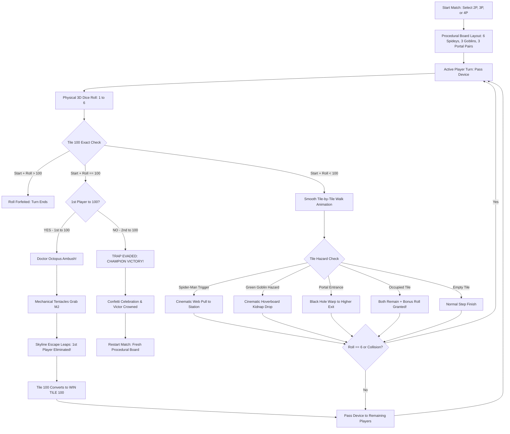

# SPIDER-MAN SNAKES & LADDERS 3D 🎯


### Basic Details
**Team Name**: SHADOWS  

**Team Members**:  
- **Team Lead**: SIDHARTH D - [College of Engineering Attingal]  
- **Member 2**: SANJU LAKSHMAN B - [College of Engineering Attingal]  

---

### Project Description
An absurdly over-engineered 3D anime browser game called **"Spider-Man Snakes & Ladders"** that has **strictly ZERO snakes and ZERO ladders**. Built for an 18-hour hackathon, 2 to 4 human players pass-and-play locally on a single device as identical Mary Janes (distinguished strictly by hair color: Auburn Red, Electric Cyan, Golden Blonde, and Toxic Emerald) navigating a 100-tile rooftop board guarded by 6 Spider-Men with mechanical gold legs, 3 hoverboard-flying Green Goblins, and 3 dark-singularity black-hole portals—with an insane climax where the **1st player to reach Tile 100 is ambushed and captured by Doctor Octopus**, springing the trap so the **2nd player to reach Tile 100 wins the game!**

---

### The Problem (that doesn't exist)
Traditional board games like *Snakes & Ladders* have suffered for centuries from a severe, unacceptable lack of web-slinging superheroes, pumpkin bombs, dark gravitational wormholes, and tentacled supervillains ambushing players at the finish line. Millions of friendships are ruined by boring 2D flat cardboard dice rolls when what the world truly needed was an over-the-top 3D Marvel anime thriller on a Manhattan skyscraper where winning requires sacrificing your best friend to Doctor Octopus so you can snatch the victory trophy right behind them.

---

### The Solution (that nobody asked for)
We built a completely physical 3D anime universe in the browser! Players choose between **2-Player, 3-Player, or 4-Player** pass-and-play modes on a single device, controlling identical Mary Janes differing strictly by vibrant hair colors (Auburn Red, Electric Cyan, Golden Blonde, Toxic Emerald). 
- Instead of climbing ladders, **6 Spider-Men** visibly fire web lines across the 3D board to yank you forward through mid-air.
- Instead of sliding down snakes, **3 Green Goblins** tackle you onto their jet hoverboards and kidnap you downward.
- **3 Portal Pairs (6 black-hole singularities)** warp you upward into the cosmos.
- **The Tile 100 Dual Climax**:
  - When the **1st Player** reaches Tile 100 with an exact roll: **Doctor Octopus** erupts from above, grabs them in mechanical titanium claws, and repeatedly leaps across the skyline into the fog—eliminating them!
  - Tile 100 springs open and converts on the physical board into the golden **🏆 WIN TILE 100**.
  - The **2nd Player** (or next active player) to roll the exact count to Tile 100 escapes the ambush and **WINS THE GAME!**

---

### Technical Details

#### Technologies/Components Used

**For Software:**
- **Languages used**: JavaScript (ES6+ Modules), HTML5, Vanilla CSS3 (Custom 3D Theme & Anime Design System)
- **Frameworks used**: Vite (Next-generation lightning-fast frontend tooling)
- **Libraries used**: Three.js (WebGL 3D Engine), Canvas-Confetti
- **Tools used**: Git, GitHub, Antigravity IDE, Web Audio API (100% procedural sound synthesis — 0 external audio files)

**For Hardware:**
- *Main components*: N/A (Pure Software 3D WebGL Application)
- *Specifications*: Runs smoothly in modern browsers on Laptop, Desktop, Android, and iPhone devices.
- *Tools required*: Web browser with WebGL support (Chrome, Edge, Safari, Firefox).

---

### Implementation

#### For Software:

**Installation**:
```bash
# Clone the repository
git clone https://github.com/UG-SIDHARTH/useless_project_temp.git

# Navigate to project directory
cd useless_project_temp

# Install dependencies
npm install
```

**Run**:
```bash
# Start the local development server (runs on Port 9000)
npm run dev

# Open in browser
http://localhost:9000/
```

**Production Build**:
```bash
npm run build
npm run preview
```

---

### Project Documentation

#### For Software:

**Screenshots**:

  
*Start Screen: Interactive 2-Player, 3-Player, and 4-Player mode selection with real-time previews of all 4 MJ twins (Auburn Red, Electric Cyan, Golden Blonde, Toxic Emerald) and multiverse rules.*

  
*3D Serpentine Board: Real physical 100-tile environment atop a Manhattan rooftop with 6 Spider-Men (gold legs) and 3 Green Goblins (hoverboards).*

  
*Tile 100 Dual Climax: 1st player is ambushed and abducted into the skyline by Doc Ock; Tile 100 dynamically transforms into the golden WIN TILE 100 where the 2nd player claims victory.*

**Diagrams**:

*Game Architecture & Turn Workflow:*



#### For Hardware:

**Schematic & Circuit**:
- *Circuit*: N/A (Pure Software Application)
- *Schematic*: N/A (Pure Software Application)

**Build Photos**:
- *Components*: N/A (Pure Software Application)
- *Build Process*: Vite bundle transformation & Three.js WebGL canvas pipeline.
- *Final Build*: WebGL canvas embedded in responsive HTML5/CSS3 application shell.

---

### Project Demo

**Video**:  
[](https://drive.google.com/file/d/1pII2Ph5zqPMMzu-IdNoXqqxA6Ay4c_qh/view?usp=sharing)  
🔗 **Direct Video Link**: [https://drive.google.com/file/d/1pII2Ph5zqPMMzu-IdNoXqqxA6Ay4c_qh/view?usp=sharing](https://drive.google.com/file/d/1pII2Ph5zqPMMzu-IdNoXqqxA6Ay4c_qh/view?usp=sharing)  

*Video demonstrates 2P, 3P, and 4P pass-and-play modes, 3D dice physics, Spider-Man web pulls, Green Goblin hoverboard kidnapping, dark singularity portal warps, the Doctor Octopus 1st-player abduction, and the 2nd-player Tile 100 championship victory.*

**Additional Demos**:  
- **GitHub Repository**: [https://github.com/UG-SIDHARTH/useless_project_temp](https://github.com/UG-SIDHARTH/useless_project_temp)  
- **Live Local URL**: `https://shadow.ugsidharth.in/)`

---

### Team Contributions

- **SIDHARTH D**:
  - Core 3D engine integration using Three.js and custom render loop.
  - Procedural board layout generation (randomizing 6 Spider-Men, 3 Goblins, and 3 Portal Pairs with safety distance constraints).
  - 3D physical dice simulation and unpredictable crypto-safe random generation.
  - Multi-player (2P, 3P, 4P) turn resolution logic, collision bonus roll system, and 1st player captured / 2nd player win rules.
  - Build optimization, Git architecture, and zero-latency single-device state management.

- **SANJU LAKSHMAN B**:
  - 3D character modeling and animation rigs (identical Mary Jane characters with Auburn Red, Electric Cyan, Golden Blonde, and Toxic Emerald hair).
  - 3D entity design: 6 Spider-Men with 4 articulated gold waldoes, 3 Green Goblins with spiked hoverboards.
  - Doctor Octopus Tile 100 boss rig with 4 articulated titanium tentacles and 3-stage skyline leap escape animation.
  - Manga/Anime visual theme design, responsive comic HUD overlay, and 100% procedural Web Audio synthesizer.
